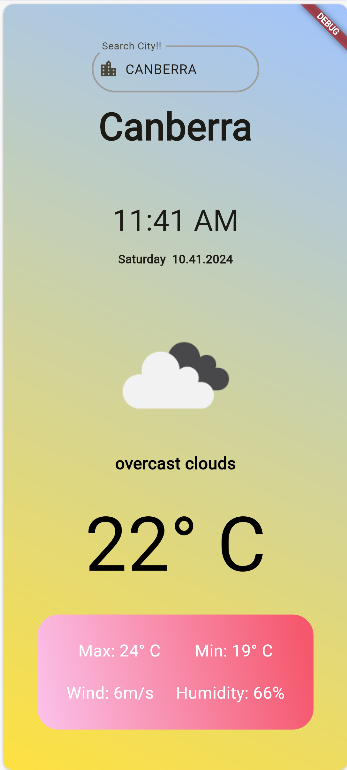

# Weather App

A Flutter weather app that provides current weather information for a specified location.

## Features

- Display current temperature, weather icon, and description.
- Show location name, date, and time.
- Provide additional weather information such as maximum and minimum temperature, wind speed, and humidity.

## Prerequisites

Before running the app, make sure you have the following installed:

- Flutter SDK
- Dart SDK
- API key from OpenWeatherMap (Sign up at [OpenWeatherMap](https://openweathermap.org/) to obtain an API key)
## Usage

1. **Navigate to the project directory:**

    ```bash
    cd your-weather-app
    ```

2. **Create a file named `.env` in the root directory and add your OpenWeatherMap API key:**

    ```makefile
    OPENWEATHER_API_KEY=your-api-key
    ```

3. **Run the app:**

    ```bash
    flutter run
    ```

### Usage Details

- The app displays current weather information for the default location (Melbourne) on launch.
- Main screen features include location name, date, time, weather icon, and temperature.
- Additional weather details include maximum and minimum temperature, wind speed, and humidity.

## Screenshots




## Folder Structure

- **lib**: Contains the main source code of the Flutter app.
  - **Pages**: Contains the pages/screens of the app.
- **screenshots**: Contains screenshots of the app.

## Dependencies

- [intl](https://pub.dev/packages/intl): For formatting date and time.
- [weather](https://pub.dev/packages/weather): A Dart library for interacting with the OpenWeatherMap API.


## Installation

1. **Clone the repository:**

   ```bash
   git clone https://github.com/your-username/your-weather-app.git
